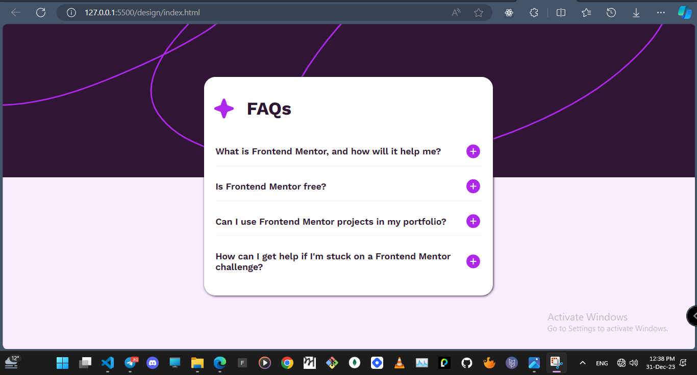

# Frontend Mentor - FAQ accordion solution

This is a solution to the [FAQ accordion challenge on Frontend Mentor](https://www.frontendmentor.io/challenges/faq-accordion-wyfFdeBwBz). Frontend Mentor challenges help you improve your coding skills by building realistic projects.

## Table of contents

- [Overview](#overview)
  - [The challenge](#the-challenge)
  - [Screenshot](#screenshot)
  - [Links](#links)
- [My process](#my-process)
  - [Built with](#built-with)
- [Author](#author)

## Overview

### The challenge

Users should be able to:

- Hide/Show the answer to a question when the question is clicked
- See hover and focus states for all interactive elements on the page

### Screenshot

### Links

- Live Site URL: (https://your-live-site-url.com](https://faq-accordion-peach-two.vercel.app/)

## My process

### Built with

- Semantic HTML5 markup
- CSS custom properties
- Flexbox
- Event Listeners
- Query Selectors

## Author

- Frontend Mentor - [@rahulkumarpahwa](https://www.frontendmentor.io/profile/rahulkumarpahwa)
- Twitter - [@rahulkumarpahwa](https://www.twitter.com/rahulkumarpahwa)
